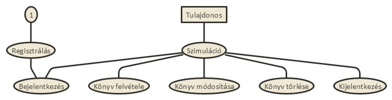
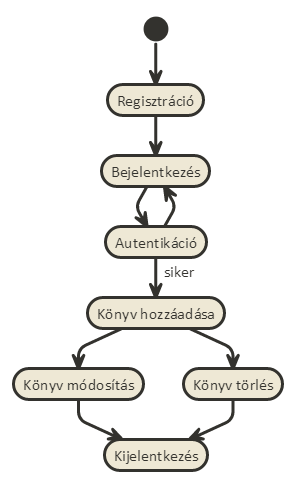
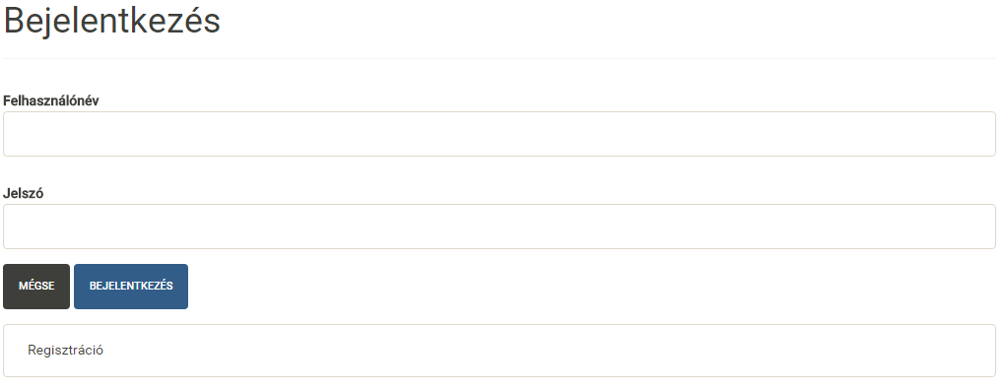
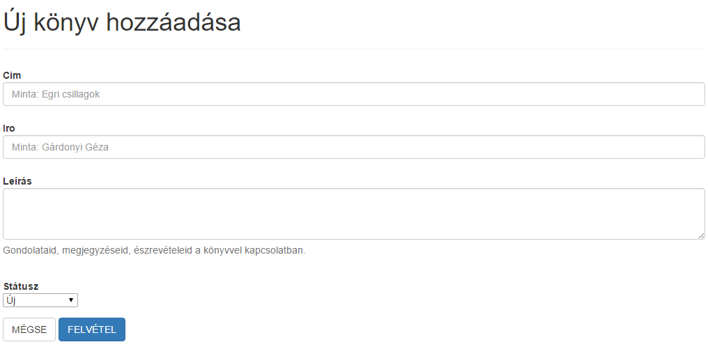
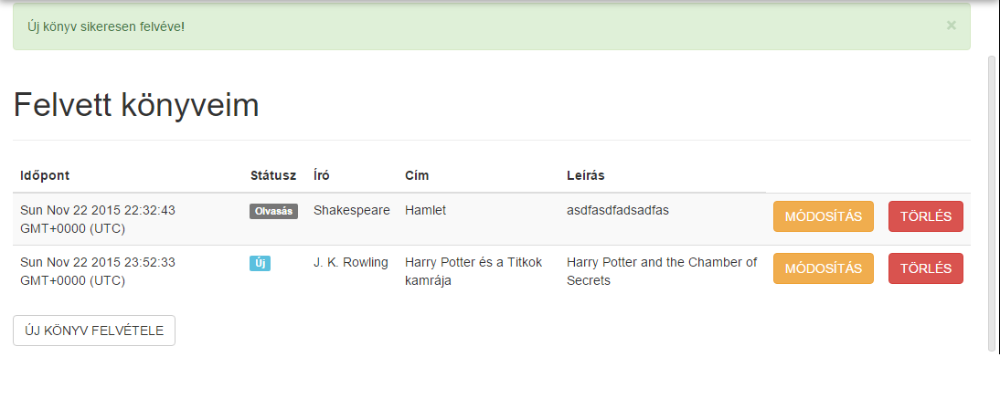
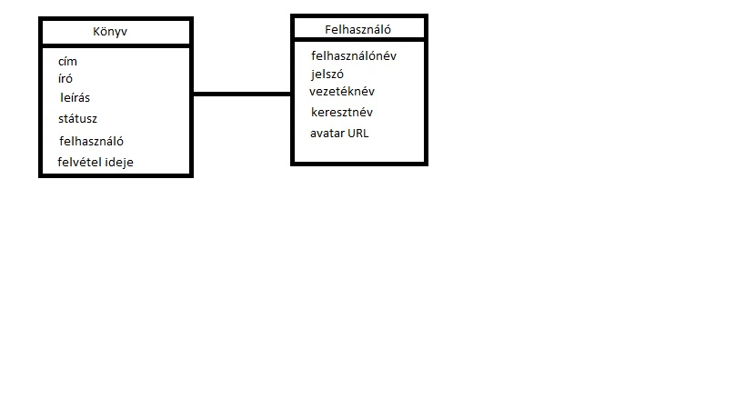
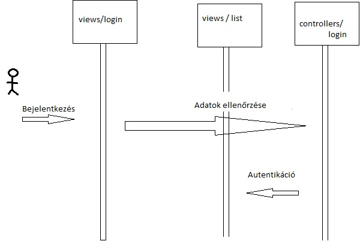

# Dokumentáció - Könyv nyilvántartó
Lukács Szabolcs - BQ2YB4 -szabolcs.lukacs@gmail.com

## Követelményanalízis
1. Követelmények:
    * Funkcionális követelmények: 
        - regisztráció után, be-kijelentkezés
        - első bejelentkezéskor könyvek nélküli lista jelenlen meg, ehhez a későbbiekben tud a user hozzáadni és majd módosítani azokat vagy akár törölni is
        - user számára láthatóvá válik az összes eddig felvett könyve, az újonnan felvettel együtt
       
    * Nem funkcionális követelmények: 
        - a felületnek egyszerűnek felhasználóbarátnak kell lennie
        - csak regisztrált userek tudnak belépni
        - csak bejelentkezést követően válik láthatóvá az eddig felvett elemek listája
        
2. Szakterületi fogalomjegyzék:
    * könyv: olyan objektum, melynek, címe, írója, hozzá fűzött megjegyzés, illetve státusza/állapota lehet
    * státusz/állapot: lehet egy könyv: új, olvasás alatt álló (olvasás), elolvasva (kész), kölcsön adva, illetve kidobásra vár
    * lista: könyvek gyűjteménye
    * módosítás: könyv adott paramétereinek a megváltoztatása
    * törlés: könyv eltávolítása a listából

3. Használatieset-modell

Használati eset diagramm

####

Új felhasználó regisztációjának, bejelentkezésének, listájának szerkesztésének folyamata

## Tervezés
1. Architektúra terv
   * Oldaltérkép: 
         - Bejelentkezés
            + Regisztráció
         - Lista oldal
            + Új könyv felvétele
            + Könyv módosítása

2. Felhasználóifelület-modell

#### 

3. Osztálymodell 
####

4. Dinamikus működés
   - Szekvenciadiagram:
 

## Implementáció
1. Fejlesztői környezet bemutatása: Cloud 9
   Ez a környezet mindamellett, hogy fejlesztőkörnyezet is egyben, felhőszolgáltatást nyújt, 
   mellyel a virtuális gépen tudjuk futtatni, tárolni, fejleszteni a projektjeinket.
   Mások munkáját segítve megtudjuk nézni a kódjukat, illetve szükség esetén szerkeszteni is tudjuk azt, ha a másik fél erre engedélyt ad. 
   Nagy előnye, hogy verziókövető rendszerekkel is össze tudjuk kapcsolni. 

2. Könyvtárstruktúrában lévő mappák funkiójának bemutatása:
   A könyvtárstuktúra az MVC (Model, View, Controller) modell alapján készült el. 
   A **views** könyvtárban lévő állományok felelnek az alkalmazás megjelenéséért. A **models** könyvtárban azok
   az állományok találhatóak, melyek az objektumok felépítéséről hivatottak gondoskodni. A **controllers** könyvtár
   állományai pedig az alkalmazás működéséért felellősek, a további könyvtárak pedig a működés elősegítésére szolgálnak.

## Tesztelés
1.Tesztelési környezet bemutatása: Zombie.js
   Egy egyszerű keretrendszer, melynek segítségével könnyen tesztelhető egy szimulált környezetben a kód, ráadásul böngészőre nincs szükség a használatához.
 
## Felhasználói dokumentáció
1.A futtatáshoz ajánlott webböngésző: 
   -Chrome, de mindegyikkel működik.
   

2. A program használata
A program indulásakor a kezdőképernyő fogadja a felhasználót. Ha már regisztrált 
felhasználóról van szó, akkor egyszerűen bejelentkezhet a már korábban megadott felhasználónévvel 
és jelszóval, különben regisztrálnia kell, felhasználónév, jelszó, vezeték- illetve keresztnév 
megadásával. Ezután a már felvett könyvek listájához érkezik a felhasználó 
(értelem szerűen új felhasználóknak üres a lista). Itt lehetősége van felvenni 
új könyveket, valamint kijelentkezni. Új könyv felvétele esetén a új oldalra navigál az alkalmazás, 
ahol meg kell adni a könyv címét, íróját, valamit megjegyzést hozzá. Ezután a könyv felkerül a listába, 
ahonnan lehet törölni illetve módosítani. Törléshez egyszerűen a kivánt sorban lévő **Törlés** gombot kell
megnyomni, módosítás esetén pedig a **Módosítás** gombot. Módosítás esetén a felhasználó egy hasonló oldalt 
lát, mint az új könyv felvétele esetén, módosíthatja az adatokat, majd visszatér a lista oldalára. Ezután ha
a kijelentkezés gombra kattint, ismét a kezdőképernyő fogadja.  
